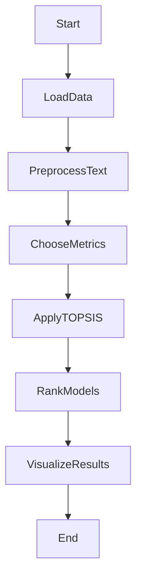

# Topsis-Pretrained-model-text-generation

# Text Summarization Model Comparison Project

## Overview

Text generation is a fundamental aspect of natural language processing, focusing on creating coherent and contextually relevant text based on input data. This project is dedicated to comparing different text generation models, guiding users in selecting the most suitable model for their specific text generation tasks.

## Key Features

### Metrics Considered

The comparison centers on key metrics such as Perplexity, BLEU Score, Latency, and ROUGE Score. 

To compare models, we employ the Technique for Order of Preference by Similarity to Ideal Solution (TOPSIS). This method involves normalizing the data for each criterion (metric) and calculating the weighted normalized decision matrix. Then, the ideal (best-case) and anti-ideal (worst-case) solutions are identified. Each model is scored based on its Euclidean distance from these ideal and anti-ideal points, allowing for a ranking that reflects both their strengths and weaknesses in a balanced manner.

### Models Evaluated

The comparison involves prominent pre-trained models like GPT-2, GPT-3, BERT, Meta-LLaMa, and XLNet, which are widely recognized in the realm of text generation.

## Project Structure

- **`data.csv`**: CSV file containing evaluation metrics for each model.
- **`result.csv`**: CSV file presenting the ranked results in a tabular format.
- **`barchart.png`**: Bar chart depicting the comparative analysis of the models.

